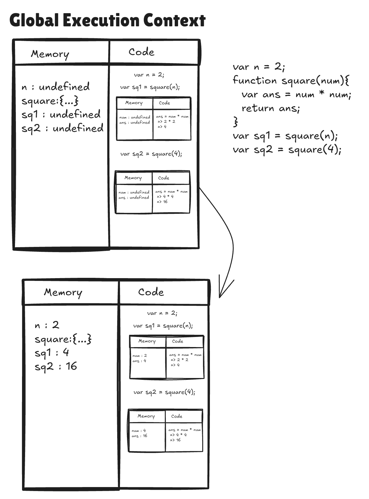
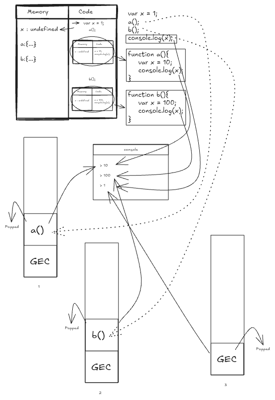
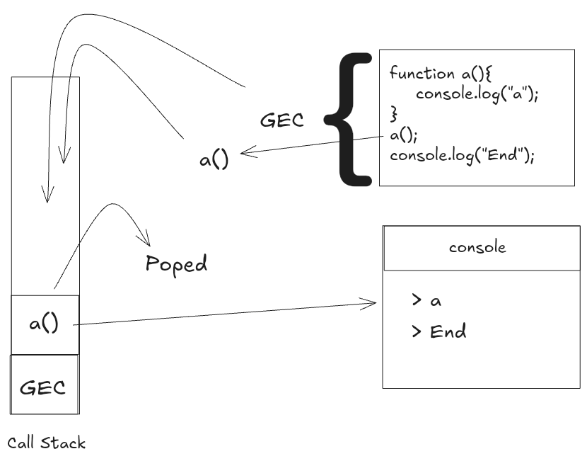
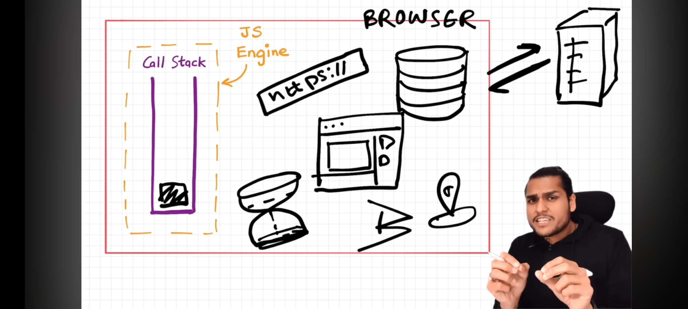
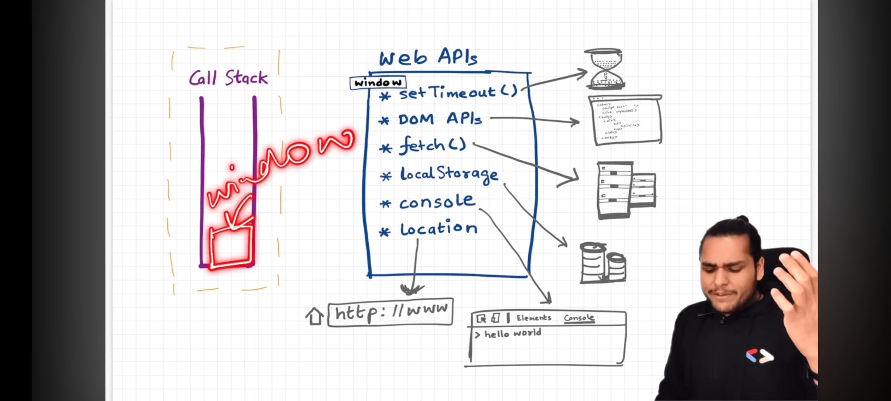
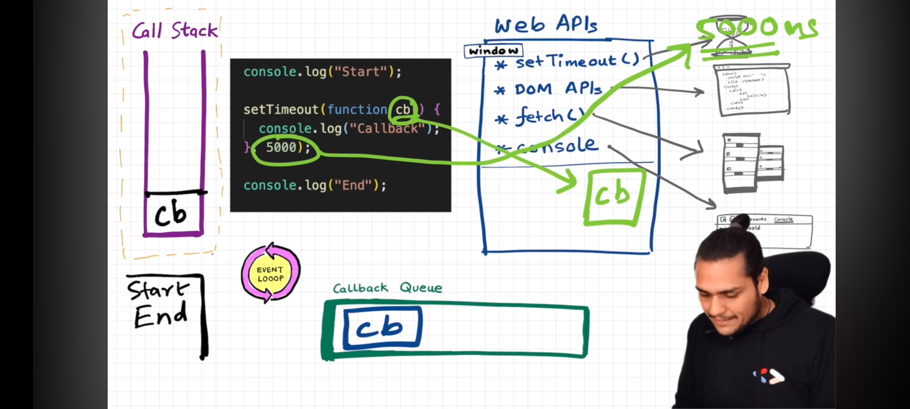
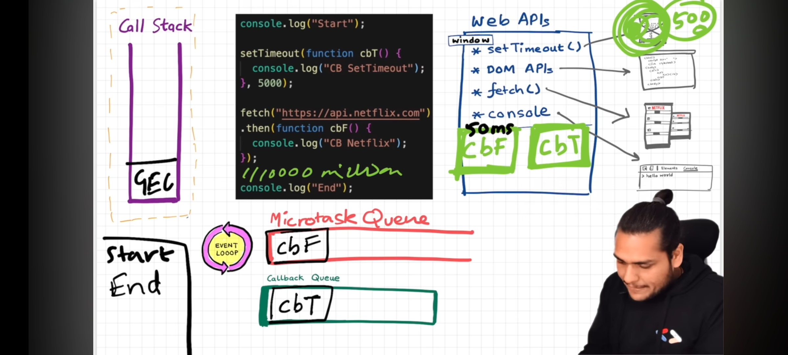

# Namaste JavaScript

## ```-> Global Execution Context```
 
 - `JavaScript is a synchronous single threaded language`
 - JavaScript Engine creates a Global Execution Context of the JavaScript file.
 - `Global Execution Context contain 2 phases`
   - `a) Memory Creation / Variable Environment`
   - `b) Code Execution / Thread Execution`
 - Memory Creation is the first phase it containes key-value pairs of variables declared in the code with a `undefined` assigned value and functions with function-name as key and the function body as the value.
 - These memory creation phase starts before actual execution of javascript file.

  
  
## ``-> Call Stack``

- JavaScript has its own `Call Stack`
- The Whole Global Execution Context is pushed into the stack for execution.
- The total execution of code is done then the call stack becomes "Empty".
- Call Stack maintains the order of execution of execution contexts.
- Call Stack is also called as `Execution Context Stack` (or) `Program Stack` (or) `Control Stack` (or) `Runtime Stack` (or) `Machine Stack`.

## ```-> Hoisting in JavaScript```

- `It is a phenomena in JavaScript by which we can access variables and call functions even before initialized it (or) invoked it without any error.`

```js
  var x = 7;
  function getName(){
    console.log("Hello");
  }
  getName();
  console.log(x);
```
console
```console
  > Hello
  > 7
```

```js
  getName();
  console.log(x);
  var x = 7;
  function getName(){
    console.log("Hello");
  }
```
console
```console
  > Hello
  > undefined
```

> [!NOTE]
> Even before Executing the code Memory will be allocated for each and every variable in javascript.

## ```-> How the Function work in JavaScript```



## ```-> Shortest JavaScript Program```

- `Empty JavaScript file` either it may be empty but javascript engine will do a lot of work.
- Even though there is nothing to execute but still it creates Global Execution Context (GEC) and setups the Memory Space.
- JavaScript Engine Creates `window object` - global object created along with GEC - looks like a big object with lot of variables and functions.
- JavaScript Engine also creates `this` keyword. - at global level `this` represents `window` object.

> [!NOTE]
> At the global level `this === window`.

```js
  var a = 10;
  function b(){
    var x = 15;
  }
  console.log(a);
  console.log(window.a);
  console.log(this.a);
```
console
```console
  > 10 
  > 10
  > 10
```

## ```-> Undefined vs not dfined in JavaScript```

- Memory creation process is happend before the code execution process. It stores variables and functions as a key-value pairs.
- In Memory creation process - It picks the variables & functions, for the variables variableName(keys) it assaigns a specifier called as `undefined`(value), for the functions functionName(keys) it assaings the body of the function(value).
```js
  console.log(a);
  var a = 10;
  console.log(a);
```
console 
```console
  > undefined
  > 10
```
  - In phase 1(`Memory Creation`): It stores variables as keys and a specifier `undefined` as their value, for the functions functionName as key and function body as value.
  - In phase 2(`Code Execution`): Where code execution actually starts.

As come to `not defined`
```js
  console.log(a);
  var a = 10;
  console.log(a);
  console.log(x);
```
console
```console
  > undefined
  > 10
  Reference Error (x is not defined)
```

## ```-> The Scope chain, Scope & Lexical Environment```

- `Scope` : Where we can access a specific variable (or) function inside our code.
- Scope is directly depends on the Lexical Environments.
- Scope of a variable is directly dependent on the lexical environment.
- Whenever an execution context is created, a lexical environment is created. Lexical environment is the local memory along with the lexical environment of its parent. Lexical as a term means in hierarchy or in sequence.
- Having the reference of parent's lexical environment means, the child or the local function can access all the variables and functions defined in the memory space of its lexical parent.
- The JS engine first searches for a variable in the current local memory space, if its not found here it searches for the variable in the lexical environment of its parent, and if its still not found, then it searches that variable in the subsequent lexical environments, and the sequence goes on until the variable is found in some lexical environment or the lexical environment becomes NULL.
- The mechanism of searching variables in the subsequent lexical environments is known as Scope Chain. If a variable is not found anywhere, then we say that the variable is not present in the scope chain

## ```-> Let, Const & Temporal Dead Zone```

- let and const are hoisted. we can't use them before initialization is result of "temporal dead zone".
- `Temporal Dead Zone` -Time since when let/const variable is hoisted and till when it is initialized to a value.
- js use diff memory than global execution context to store let and cost. which is reason behind "temporal dead zone"
- level of strictness ... var<<let<<const.
- var //no temporal dead zone, can redeclare and re- initialize, stored in GES
- let //use TDZ, can't re-declare, can re-initialize, stored in separate memory
- const //use TDZ, can't re-declare, can't re-initialize, stored in separate memory
- syntax error is similar to compile error. while type and reference error falls under run time error. -
- syntax error... violation of JS syntax
- type error... while trying to re-initialize const/let variable
- reference error... while trying to access variable which is not there in global memory.

## ```-> Block Scope and Shadowing```

- Code inside curly bracket is called block.
- Multiple statements are grouped inside a block so it can be written where JS expects single statements like in if, else, loop, function etc.
- Block values are stored inside separate memory than global. They are stored in block. (the reason let and const are called block scope)
- Shadowing of variables using var, let and const.
- The shadow should not cross the scope of original otherwise it will give error.
- shadowing let with var is illegal shadowing and gives error.
- var value is stored in nearest outer function or global scope and hence can be accessed outside block as well whereas same is not the case with let and const.

## ```-> Closures```

- `Closures` : A function bind together with its Lexical Scope.
- Combination of a function bundled together with references to its surrounding state.
- Gives access to an outer function scope from an inner function.

```js
  function x(){
    var a = 7;
    function y(){
      console.log(a);
    }
    return y;
  }
  x();
```
console
```console
  > 7
```
  - Closures are used in :
    - Module Design Pattern
    - Currying
    - Functions like once
    - Memorize
    - Maintaining state in async world
    - setTimeOuts
    - Iterators etc.,

## ```-> setTimeOut & Closures```

```js
  function x(){
    var i = 1;
    setTimeOut(function(){
      console.log(i);
    }, 3000);
    console.log("Namaste Js")
  }
```
console
```console
  > Namaste Js
  > 1
```

## ```-> Functions```

1.  What is Function Statement ?
A.  A normal function that we create using Naming convention. & By this we can do the Hoisting.
For Ex  -  
```js
  function xyz(){
    console.log("Function Statement");
  }
  ```

2.  What is Function Expression ?
A.  When we assign a function into a variable that is Function Expression. & We can not do Hoisting by this becz it acts like variable.
For Ex - 
```js
  var a = function(){
    console.log("Function Expression");
  }
```

3.  What is Anonymous Function ?
A.  A Function without the name is known as Anonymous Function. & It is used in a place where function are treated as value.
For Ex - 
```js
  function(){
  }
```

4.  What is Named Function Expression ?
A.  A function with a name is known as Named Function Expression.
For Ex - 
```js
  var a = function xyx(){
    console.log("Names Function Expression");
  }
  ```

5.  Difference b/w Parameters and Arguments ?
A.  When we creating a function & put some variabels in this ( ) that is our Parameters.
For Ex - 
```js
  function ab(param1, param2 ){
    console.log("
  }
  ```
& When we call this function & pass a variabel in this ( ) that is our Arguments
For Ex - 
```js
  ab( 4, 5 );
```

6.  What is First Class Function Or First class citizens?
A.  The Ability of use function as value,
  * Can be passed as an Argument,
  * Can be executed inside a closured function &
  * Can be taken as return form.
For Ex - 
```js
  var b = function(param){
    return function xyz(){
      console.log(" F C F ");
    }
  } 
```

7. Function are heart of JS. They are called first class citizens or first class functions because they have the ability to be stored in the variables, passed as parameters and arguments. They can also be returned in the function

## ```-> Callback Functions```

1. Function that is passed on as argument to another function is called `callback function`.
2. Event listeners can also invoke closures with scope.
3. Event listeners consume a lot of memory which can potentially slow down the website therefore it is good practice to remove if it is not used.

## ```-> Garbage Collection & removeEventListeners```

  - Event Listeners can also invoke clousers with scope.
  - Event Listeners consumes lot of memory which can potentially slow down the website therefore it is good practice to remove if its not used.
  - `setTimeout` doesnot help to convert from sync to async. Actually the first class functions helps JavaScript to convert from 'sync' to 'async'

## ```-> Event Loop```

  
  
  - After completing tasks inside of a's Execution Context it will be popped out of the call stack.
  - Completing Execution of whole program code it popsout the `Global Execution Context`, now the call stack becomes empty.
  
  
  
  - Browser has super powers that are lent to JavaScript Engine to execute some tasks, these super powers include:
  - Web API's 
    - `console`
    - `DOM API`
    - `setTimeout`
    - `fetch`
    - `local storage`
  
  

  - Callback functions and Event Handlers are first stored in Web API environment and then transfered to `callback queue`.

  
  
  - `Promises` and `Mutation Observer` are stored in API environment and then transfered to `microtask queue`.
  - `Event Loop` continuosly observes callstack and when it is empty it transfers task to `call stack`.
  - `Microtask queue` is given priority over `callback tasks`.
  - Too many microtasks generated can cause `Starvation` - Not giving time to callback tasks to execute.
  
  

## ```-> JavaScript Runtime Environment```

  - JavaScript Runtime Environment contains all elements required to run JavaScript.
  - It contains `JavaScript Engine`, `Set of API's`, `Callback Queue`, `Microtask Queue`, `Event Loop`.
  - JavaScript Engine is not a machine, its Just a Piece of Code.
  - Process of executing JavaScript code : `code -> Parsing -> Compilation -> Execution`.
  - Parsing breaks code into tokens and converts it into `Abstract Syntax Tree (AST)`.
  - Modern JavaScript Engine follows, JIT compilation, it interpretes while it optimises code as much as it can.
  - `Execution and compilation are done together`.
  - Also have a `Garbage Collector` and `other optimisation` such as `inlining`, `copy elusion`, `inline catching` etc.,
  - `Mark & Sweep Algorithm`: 
    - Global collection in JavaScript works by tracking references to objects in memory and removing objects that are no longer referenced by the application.
    - JavaScript Engine uses a technique called the `Mark-and-Sweep` algorithm to identify and remove objects and variables that are no longer in use.
    - The algorithm works by starting with a set of `roots` (typically the Global Object).
    - The algorithm then recursively traverses the object graph, marking all objects and variables that are still in use.
    - Once all alive objects & variables have been marked, the garbage collector then safely removes any objects and variables that have not been marked, as they are no loger required.
  - `Inlining Optimization`:
    - Eliminates the overlead of the function call.
    - Inlining Optimization in JavaScript refers to the process where the JavaScript engine replaces a function call with the body of the function itself.
  - `Copy Elision`:
    - Copy Elision is an optimization implemented by most compilers to prevent extra copies in certain situations.
    - It makes returning by value or pass-by-value feasible in practice.
  - `Inline Caching`
    - Inline caching is an optimization technique that relies upon the observation that repeated calls to same function tends to occur on same type of objects.

## ```-> Trust Issues with setTimeout()```

  ```js
    console.log("Start");
    setTimeout(function cb(){
      console.log("Callback");
    },5000);
    console.log("End");
  ```
  console
  ```console
    > Start
    > End
    > Callback
  ```
  - Global Execution Context pushed to callstack.
  - In this example code, "Start" will be printed to the console.
  - setTimeout callback function i.e., cb is Registered at Web API's environment to push into Callback Queue.
  - At the time JavaScript Engine waits for no one, so it print(Executes) rest of the code "End" will be printed at console.
  - When ever 5000ms are over callback function cb() is pushed into callback queue, Event Loop is constantly checking the callstack is empty or not, if the callstack become empty i.e., GEC is popped out from the callstack then Event Loop pushes cb from callback queue to callstack so then it executes callback function statements i.e.,it prints 'callback' to the console.
  - In some cases, after setTimeout() function when we have some million lines of code that take 10sec to execute then
    1. GEC is pushed to the Call Stack.
    2. "Start" printed to the console.
    3. setTimeout callbak function is registered at Web API's and timer is started after timer complition for 5000ms it pushed into callstack to become empty.
    4. million lines of code will be executed for the 10sec then GEC will be popped out of the callstack, event loop pushes callback function in callback queue to callstack.
    5. Callback function will be executed(quickly).
  - The `setTimeout` function stores it in the callback queue which is executed only after callstack is empty, even if `setTimeout` is set to 0ms.
  - `setTimeout` ensures that minimum it will take the tme mentioned because it may be paused due to callstack not empty.
  
## ```-> Higher Order Function```
  
  - A function which will take another function as an argument or returns a function from it, is called `Higher Order Function`.
  
  ```js
    function x(){
      console.log("Namaste");
    }
    function y(x){
      x();
    }
    y(x);
  ```
x - `Callback Function`
y - `Higher Order Function`

console
```console
  > Namaste
```
#### Calculating area,circumference and diameter of list of Radiuses

```js
  const radius = [3,6,2,5];
  
  const calculateArea = function(radius){
    const output1 = [];
    for(let i = 0; i < radius.length; i++){
      output1.push(Math.PI * radius[i] * radius[i]);
    }
    return output1;
  }
  const calculateCircumference = function(radius){
    const output2 = [];
    for(let i = 0; i < radius.length; i++){
      output2.push(2 * Math.PI * radius[i]);
    }
    return output2;
  }
  const calculateDiameter = function(radius){
    const output3 = [];
    for(let i = 0; i < radius.length; i++){
      output3.push(2 * radius[i]);
    }
    return output3;
  }
  console.log("Areas: "+calculateArea(radius));
  console.log("Circumferences: "+calculateCircumference(radius));
  console.log("Diameters: "+calculateDiameter(radius));
```
console
```console
  > Areas: [28.274333882308138, 113.09733552923255, 12.566370614359172, 78.53981633974483]
  > circumferences: [18.84955592153876,37.69911184307752,12.566370614359172,31.41592653589793]
  > Diameters: 6,12,4,10
```

- To avoid using of repetition code for calculating area, circumference and diameter we use Higher Order Functional concept.

```js
  const radius = [3, 6, 2, 5];
  
  const area = function(radius){
    return Math.PI * radius * radius;
  }
  
  const circumference = function(radius){
    return 2 * Math.PI * radius;
  }
  
  const diameter = function(radius){
    return 2 * radius;
  }
  
  const calculate = function(radius, logic){
    const output = [];
    for(let i = 0; i < radius.length; i++){
      output.push(logic(radius[i]));
    }
    return output;
  }
  
  console.log(calculate(radius, area));
  console.log(calculate(radius, circumference));
  console.log(calculate(radius, diameter));
```
console
```console
  > [28.274333882308138, 113.09733552923255, 12.566370614359172, 78.53981633974483]
  > [18.84955592153876,37.69911184307752,12.566370614359172,31.41592653589793]
  > 6,12,4,10
```
- The calculate function works similar as `map()` function, we can also use `map()`
  - i.e., 
    ```js
      console.log(radius.map(area));
      console.log(radius.map(circumference));
      console.log(radius.map(diameter));
    ```
- To make the calculate function work similar as `map()` function
    ```js
      Array.prototype.calculate = function(logic){
        const output = [];
        for(let i = 0; i < this.length; i++){
          output.push(logic(this[i]));
        }
        return output;
      }
      console.log(radius.calculate(area));
    ```
 
## ```-> map(), filter() & reduce()```

- `map()`: used to transform an array
- transform - getting new valued array from the existing one.
```js
  const arr = [5, 1, 3, 2, 6];
  
  // Double
  function double(x){
    return 2 * x;
  };
  const output1 = arr.map(double);
  console.log(output1);
  
  // Triple
  function triple(x){
    return 3 * x;
  };
  const output2 = arr.map(triple);
  console.log(output2);
  
  // Binary
  function binary(x){
    return x.toString(2);
  };
  const output3 = arr.map(binary);
  console.log(output3);
```
console
```console
  > [10, 2, 6, 4, 12]
  > [15, 3, 9, 6, 18]
  > ["101", "1", "11", "10", "110"]
```

- `filter()` - used to filter the values inside an array
```js
  const arr = [5, 1, 3, 2, 6];
  // filter odd values
  const output = arr.filter(isOdd);
  console.log(output);
  function isOdd(x{
    return x % 2;
  });
```
console
```console
  > [5, 1, 3]
```

- `reduce()` - used where we have to take all of the array values and comeout of the single value
```js
  const arr = [5, 1, 3, 2, 6];
  
  function findSum(arr){
    let sum = 0;
    for(let i = 0; i < arr.length; i++){
      sum = sum + arr[i];
    }
    return sum;
  }
  console.log(findSum(arr));
```
console
```console
  > 17
```
 - can also written using `reduce()`
 ```js
  const arr = [ 5, 1, 3, 2, 6];
  
  const output = arr.reduce(function(acc, curr){
    acc = acc + curr;
    return acc;
  },0); // 0 --> acc value
  
  console.log(output);
 ```
console
```console
  > 17
```

## ```-> Callback Hell```

 - Callback function enables us to do `async programming` in JavaScript. 
 - We use this for some functions that are interdependent on each other for execution.
 - for e.g., Ordering can be done after adding items in cart. So we pass callback functions as argument to functions which then call the callback function passed. However this causes some problems.
 - a) `Callback Hell`: When a callback function is kept inside another function, which in turn is kept inside another function (in short, a lot of nested callbacks).
    - This causes a `pyramid of DOOM` structure causing our code to grow horizontally, making it tough to manage our code.
 - b) `Inversion of Control`: This happens when the control of program is no longer in our hands. In nested functions one API call the callback function received but we don't know how the code is written inside that API and how will it effect our code.
    - Will our function be called or not ?
    - What if called twice ?
    - What if it has bugs inside it ?
    - We have given control of our code to other code ?

## ```-> Promises```

 - `Promises are used to handle async operations in JavaScript`.
 - `Promise`:
    - Promise is called as a Placeholder, which will be filled later with a value.
    - Placeholder for a certain period of time untill we receive a value from asynchronous operation.
    - Container for a future value.
    - `A Promises is an object representing the eventual completion or failure of an asynchronous operation.`
 - Promises are `immutable`.
 - Promises have only 3 states : 
    - Pending
    - Fulfilled
    - Rejected
 - Before Promises we used to depend on callback function which would result in 
    - Callback Hell (Pyramid of DOOM).
    - Inversion of Control.
 - Inversion of Control is overcome by using promise.
    - A Promise is an object that represents eventual Completion/ Failure of an asynchronous operation.
    - A promise has 3 states: Pending, Fullfilled & Rejected.
    - As soon as promise is fulfilled/ rejected => It updates the empty object which is assigned undefned in pending state.
    - A promise resolves only once and it is immutable.
    - Using `.then()` we can control then we call the callback function.
 - To avoid callback hell (Pyramid of DOOM) => We cna promise chaining. This way our code expands vertically instead of horizontally, chaining is done using `.then()`
 - A very common mistake that developers do is not returning a value during chaining of promises. Always remember to return a value. This returned value will be used by the next `.then()`.

## ```-> Promise Chain```

 - Promise chain can be created using `new Promise()` constructor function which takes a callback function as argument.
 - This callback function has 2 arguments named `resolve` and `reject`.
 - We can only resolve / reject a promise nothing else can be done.
 - Always remember to return a value in the promise chain for the next `.then()` to use.
 - If it returns a value -> it will be used as an argument in next function (promise function).
 - We can handle errors in promises using `.catch()`
```js
  const cart=[
     {item:"shoes", value:200},
     {item:"cloths", value:300},
     {item:"accessories", value:750},
     {item:"bags", value:250}
     ];
     
  let wallet = 500;
  const discount = 20;
  const time = 2000;
  
  createOrder(cart)
    .then(function(orderId){
        console.log(orderId);
        return orderId;
    })
    .then(function(){
        return proceedToPayment(cart);
    })
    .then(function(details){
        return showOrderSummary(details);
    })
    .then(function(discountPrice){
        return updateWallet(discountPrice, wallet);
    })
    .then(function(wallet){
      return showBalance(wallet);
    })
    .catch(function(err){
      console.log(err.message);
    })
  
  
  function validateCart(cart){
      return true;
  }
  
  function createOrder(cart){
      const pr = new Promise(function(resolve,reject){
          if(!validateCart(cart)){
              const error = new Error("cart is not valid!");
              reject(error);
          }
          else{
              const orderId = Math.floor(10000 + Math.random() * 90000);
              resolve(orderId);
          }
      })
      
      return pr;
  }
  
  function proceedToPayment(cart){
      return new Promise(function(resolve, reject){
          let input = prompt("select your choice\n1. shoes 2. cloths 3. accessories 4. bags");
          if(input <= cart.length && input >= 1){
          var inputItem = cart[input-1].item;
          var inputValue = cart[input-1].value;
          var details = `${inputItem} ${inputValue}`;
          resolve(details);
          //resolve(inputValue)
          }
          else{
            const error = new Error("Invalid Input!");
            reject(error);
          }
      })
  }
  
  function showOrderSummary(details){
    details = details.split(' ');
    let inputItem = details[0];
    let inputValue = details[1];
    let discountPrice = inputValue - (inputValue*discount/100)
    //console.log(details)
      return new Promise(function(resolve, reject){
        setTimeout(()=>{
           console.log(`Choosen Item :\t${inputItem}\nItem Value :\t${inputValue}\nDiscount Percentage :\t${discount}% off\nTotal :\t${discountPrice}\n`);
        
          resolve(discountPrice);
        },time)
         
      })
  }
  
  function updateWallet(discountPrice, wallet){
    return new Promise(function(resolve, reject){
      if(wallet >= discountPrice){
      wallet = wallet - discountPrice;
      setTimeout(()=>{
         console.log("Wallet Updated Successfully!");
      //proceedToPayment(cart);
      resolve(wallet);
      },time)
     
      }
      else{
        const error = new Error("Insufficient Balance!");
        reject(error);
      }
    })
  }
  
  function showBalance(wallet){
    return new Promise(function(resolve, reject){
      setTimeout(function(){
        console.log(`Balance Ammount :\t${wallet}`);
        resolve(wallet);
      },time)
        
    })
  }
```

## ```-> async await```

 - `async` is a keyword used before a function to create `async function`.
 - async function `always returns a promise`.
    - Either we return a promise from async function.
    - If it returns a value then this function will automatically wrap the value inside a promise and return that promise.
```js
  async function getData(){
    return "Namaste";
  };
  
  const dataPromise = getData();
  dataPromise.then(res => console.log(res));
  
```
console
```console
  > Namaste
```

```js 
  const p = new Promise((resolve, reject) => {
    resolve("Promise Resolved!");
  });
  
  async function getData(){
    return p;
  }
  
  const dataPromise = getData();
  dataPromise.then(res => console.log(res));
```
console
```console
  > Promise Resolved!
```
 - async & await combo is used to `Handle Promises`.
 - `await` is a keyword that can only be used inside an async function.
```js
  const p = Promise((resolve, reject) => {
    resolve("Promise Resolved Value");
  });
  
  function getData(){
    p.then((res)=>console.log(res));
  }
  getData();
```
console
```console
  > Promise Resolved Value
```

Using async & await
```js
  const p = Promise((resolve, reject) => {
      resolve("Promise Resolved Value");
    });
    
    async function getData(){
      const val = await p;
      console.log(val);
    }
    getData();
```
console
```console
  > Promise Resolved Value
```
 - Differences between handling promises using async function and normal way

Normal way
```js
  const p = new Promise((resolve, reject)=>{
    setTimeout(()=>{
      resolve("Promise Resolved Value");
    },10000);
  });
  function getData(){
    p.then(res => console.log(res));
    console.log("Namaste");
  }
  getData();
```
console
```console
  > Namaste  ->  0ses
  > Promise Resolved Value  -> 10 sec
```

Using async & await
```js
  const p = new Promise((resolve, reject)=>{
    setTimeout(()=>{
      resolve("Promise Resolved Value");
    },10000);
  });
  async function getData(){
    const val = await p;
    console.log("Namaste");
    console.log(val);
  };
  getData();
```
console
```console
  > Namaste  -> 10sec
  > Promise Resolved Value
```

```js
  const p = new Promise((resolve, reject)=>{
    setTimeout(()=>{
      resolve("Promise Resolved Value");
    }, 10000);
  });
  async function handlePromise(){
    console.log("Before Handling Promise");
    const val = await p;
    console.log("After Handling Promise");
    console.log(val);
  };
  
  console.log("Before Calling handlePromise");
  handlePromise();
  console.log("After Calling handlePromise");
```
console
```console
  > Before Calling handlePromise
  > Before Handling Promise
  > After Calling handlePromise
  > After Handling Promise
  > Promise Resolved Value
```

RealWorld Example of async / await
```js
  const API_URL = "https://api.github.com/users/javid4962";
  
  async function getData(){
    const data = await fetch(API_URL);
    const dataJSON = await data.json();
    console.log(dataJSON);
  }
  getData();
```
console
```console
  > Object { login: "javid4962", id: 76842254, node_id: "MDQ6VXNlcjc2ODQyMjU0", avatar_url: "https://avatars.githubusercontent.com/u/76842254?v=4", gravatar_id: "", … }
```

## ```-> Promise API's```
 - Used to handle multiple promises.

#### `Promise.all([])`
 ```js
  Promise.all([p1, p2, p3]);
 ```
 - p1, p2, p3 -> promises
 - `Promise.all` takes an iterable (usually, an array of promises) and returns a new promise.
 - The new promise resolves when all listed promises are resolved, and the array of their results becomes its result.
 - If one promise rejects, Promise.all immediately rejects, completely forgetting about the other ones in the list. Their results are ignored.
 
```js
  const p1 = new Promise((resolve, reject) =>{
    resolve("p1 resolved");
  });
    
  const p2 = new Promise((resolve, reject) =>{
    resolve("p2 resolved");
  });
    
  const p3 = new Promise((resolve, reject) =>{
    resolve("p3 resolved");
  });
  
  Promise.all([p1, p2, p3]).then((res) => console.log(res));
```
console
```console
  > ["p1 resolved","p2 resolved","p3 resolved"]
```
```js
  const p1 = new Promise((resolve, reject) => {
    reject("p1 rejected");
  });
  
  const p2 = new Promise((resolve, reject) => {
    resolve("p2 resolved");
  });
  
  const p3 = new Promise((resolve, reject) => {
    resolve("p3 resolved");
  });
  
  Promise.all([p1, p2, p3])
    .then((res) => console.log(res))
```
console
```console
  > p1 rejected
```

#### `Promise.allSettled([])`
 - Promise.allSettled just waits for all promises to settle, regardless of the result. 
 - The resulting array has:
    - {status:"fulfilled", value:result} for successful responses,
    - {status:"rejected", reason:error} for errors.
```js
  const p1 = new Promise((resolve, reject) =>{
    resolve("p1 resolved");
  });
    
  const p2 = new Promise((resolve, reject) =>{
    resolve("p2 resolved");
  });
    
  const p3 = new Promise((resolve, reject) =>{
    resolve("p3 resolved");
  });
  
  Promise.allSettled([p1, p2, p3])
    .then((res) => res.map((i)=>{
      console.log(i.value)
  }))
```
console
```console
  > p1 resolved
  > p2 resolved
  > p3 resolved
```
```js
  const p1 = new Promise((resolve, reject) => {
    reject("p1 rejected");
  });
  
  const p2 = new Promise((resolve, reject) => {
    resolve("p2 resolved");
  });
  
  const p3 = new Promise((resolve, reject) => {
    resolve("p3 resolved");
  });
  
  Promise.allSettled([p1, p2, p3])
    .then((res) => res.map((i)=>{
      console.log(i.value)
  }))
```
console
```console
  > undefined
  > p2 resolved
  > p3 resolved
```

#### `Promise.race([])`
 - Similar to Promise.all, but waits only for the first settled promise and gets its result (or error).
 - The first promise here was fastest, so it became the result. After the first settled promise “wins the race”, all further results/errors are ignored.
```js
  const p1 = new Promise((resolve, reject) => {
    setTimeout(()=>{
    resolve("p1 resolved");
    },5000)
  });
  
  const p2 = new Promise((resolve, reject) => {
    setTimeout(()=>{
    resolve("p2 resolved");
    },2000)
  });
  
  const p3 = new Promise((resolve, reject) => {
    setTimeout(()=>{
    resolve("p3 resolved");
    },3000)
  });
  
  Promise.race([p1, p2, p3])
    .then((res) => console.log(res))
```
console
```console
  > p2 resolved
```
```js
  const p1 = new Promise((resolve, reject) => {
    setTimeout(()=>{
    resolve("p1 resolved");
    },5000)
  });
  
  const p2 = new Promise((resolve, reject) => {
    setTimeout(()=>{
    reject("p2 rejected");
    },2000)
  });
  
  const p3 = new Promise((resolve, reject) => {
    setTimeout(()=>{
    resolve("p3 resolved");
    },3000)
  });
  
  Promise.race([p1, p2, p3])
    .then((res) => console.log(res))
```
console
```console
  > p2 rejected
```

#### `Promise.any([])`
 - Similar to Promise.race, but waits only for the first fulfilled promise and gets its result.
```js
  const p1 = new Promise((resolve, reject) => {
    setTimeout(()=>{
    resolve("p1 resolved");
    },5000)
  });
  
  const p2 = new Promise((resolve, reject) => {
    setTimeout(()=>{
    resolve("p2 resolved");
    },2000)
  });
  
  const p3 = new Promise((resolve, reject) => {
    setTimeout(()=>{
    resolve("p3 resolved");
    },3000)
  });
  
  Promise.any([p1, p2, p3])
    .then((res) => console.log(res))
    .catch((err => console.log(err.errors)))
```
console
```console
  > p2 resolved
```
```js
  const p1 = new Promise((resolve, reject) => {
    setTimeout(()=>{
    resolve("p1 resolved");
    },5000)
  });
  
  const p2 = new Promise((resolve, reject) => {
    setTimeout(()=>{
    reject("p2 rejected");
    },2000)
  });
  
  const p3 = new Promise((resolve, reject) => {
    setTimeout(()=>{
    resolve("p3 resolved");
    },3000)
  });
  
  Promise.any([p1, p2, p3])
    .then((res) => console.log(res))
    .catch((err => console.log(err.errors)))
```
console
```console
  > p3 resolved
```
 - If all of the given promises are rejected, then the returned promise is rejected with AggregateError – a special error object that stores all promise errors in its errors property.
```js
  const p1 = new Promise((resolve, reject) => {
    setTimeout(()=>{
    reject("p1 rejected");
    },5000)
  });
  
  const p2 = new Promise((resolve, reject) => {
    setTimeout(()=>{
    reject("p2 rejected");
    },2000)
  });
  
  const p3 = new Promise((resolve, reject) => {
    setTimeout(()=>{
    reject("p3 rejected");
    },3000)
  });
  
  Promise.any([p1, p2, p3])
    .then((res) => console.log(res))
    .catch((err => console.log(err.errors)))
```
console
```console
  > ["p1 rejected","p2 rejected","p3 rejected"]
```

### ```-> this keyword```

 1. "this" in global scope always points to the globalObject (globalObject depends on javascript runtime env)
```js
  console.log(this);
```
console
```console
  > Window { window: Window, self: Window, document: HTMLDocument, name: "", location: Location, … }
```

 2. "this" in a function depends on 2 things 
    a. strict / non strict mode (in strict mode, "this" is undefined, in non strict mode, "this substitution" takes place and "this" points to globalObject)
```js
  "use strict";
  function strictFun(){
    console.log(this)
  }
  strictFun();
```
console
```console
  > undefined
```
 
    b. how the function is being invoked (if we invoke the function using the global object in strict mode, then "this" will point to that globalObject)
```js
  function strictFun(){
    console.log(this)
  }
  strictFun();
```
console
```console
  > Window { window: Window, self: Window, document: HTMLDocument, name: "", location: Location, … }
```
 
 3. "this" in a method always points to the object that is used to invoke the method.
```js
  const obj = {
    a : 10,
    x : function(){
      console.log(this);
    }
  }
  obj.x();
```
console
```console
  > Object { a: 10, x: ƒ }
```   
 
 4. call, apply & bind are used to share a method with another object (hence the "this" keyword reference would also change accordingly)
```js
  const student = {
    name : "Akshay",
    printName : function(){
      console.log(this.name);
    }
  }
  student.printName();
  
  const student2 = {
    name : "Deepika",
  }
  student.printName.call(student2);
```
console
```console
  > Akshay
  > Deepika
```
 
 5. "this" inside arrow function refers to the enclosing lexical context
```js
  const obj = {
    a : 10,
    x : () => {
      console.log(this)
    }
  }
  obj.x();
```
console
```console
  > Window { window: Window, self: Window, document: HTMLDocument, name: "", location: Location, … }
```
```js
  const obj = {
    a : 10,
    x : function(){
      const y = () => {
        console.log(this)
      };
      y();
    }
  }
  obj.x();
```
console
```console
  > Object { a: 10, x: ƒ }
```
 
 6. "this" in DOM points to the HTML element itself on which it is being used
```html
  <button onclick="alert(this)">Click Me</button>
```
```console
  [object HTMLButtonElement]
```


